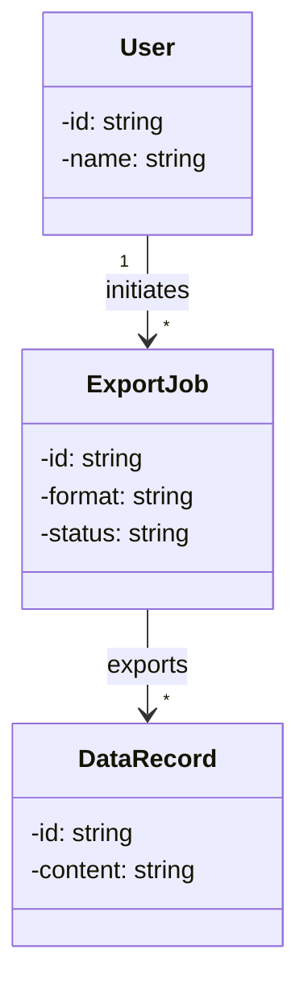
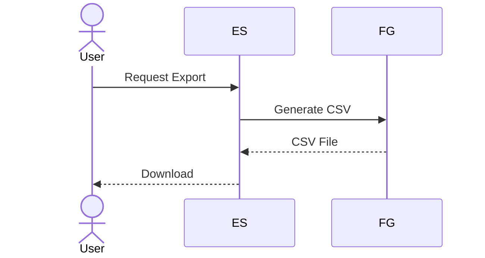
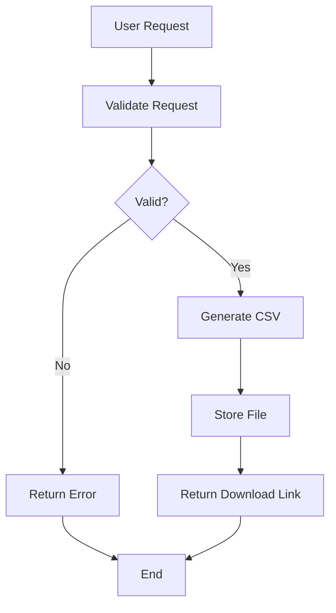

## Context

<!-- Background and current state -->

## Success Criteria

<!-- How to measure if the problem is solved -->

## Goals / Non-Goals

**Goals:**
<!-- What this design aims to achieve -->

**Non-Goals:**
<!-- What is explicitly out of scope -->

## Integration Points

| Existing Module | Integration Method | Required Changes |
|-----------------|--------------------|------------------|
|                 |                    |                  |

---

## Class Diagrams

<!-- Use subheadings for different class diagrams if needed, e.g., ### Key Classes, ### Factory Pattern -->

### Key Classes

## Sequence Diagrams

<!-- Use subheadings for different business scenarios, e.g., ### User Registration, ### Order Processing. Participant names should be sourced from AGENTS.md at project root. -->

### CSV Export

## Activity Diagrams

<!-- Use subheadings for different business scenarios, e.g., ### CSV Export Flow, ### Batch Import Flow -->

### CSV Export Flow

## Decisions

<!-- Key design decisions and rationale -->

## Risks / Trade-offs

<!-- Known risks and trade-offs -->

## Migration Plan

<!-- Steps to deploy, rollback strategy -->

## Open Questions

| Question | Priority        | Status  |
|----------|-----------------|---------|
|          | High/Medium/Low | Pending |
